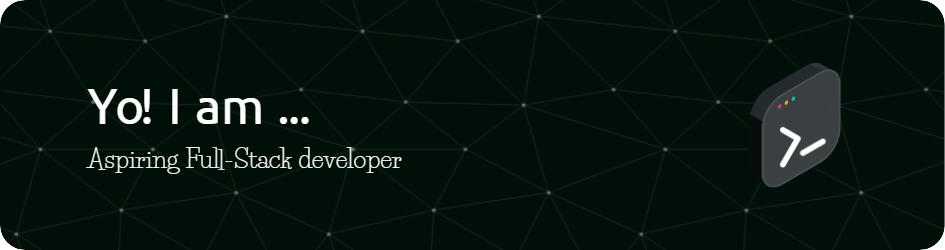

    

<h1 align="center"> 
 
 
</h1>

- 🎓 I'm currently pursuing **Bachelor's Degree** in **Computer Science**

- 🌱 I’m currently learning : **MERN Stack**

- 💬 Ask me about : **Data Structures and Algorithms, Web Developments**

- 👨‍💻 All of my projects are available at 👉 [My Portfolio](https://kris-05.github.io/Kris-Portfolio)

- 📫 How to reach me 👉 **vjkrisna995@gmail.com**

- 📄 How to hire me 👉 <a href="https://kris-05.github.io/Kris-Portfolio/pdf/Krisna-Resume.pdf">My Resume</a>

- ⚡ Fun fact : **I code, therefore, I am**

 
  
<h2>🛠️ My Favorite Tools</h2>

  <h3>1 - Programming Languages</h3>

  

  <h3>2 - Frameworks and Libraries</h3>

  
  
  <h3>3 - Databases and Technologies</h3>
  
 

  <h3>4 - Software and Tools</h3>
  
   

 
  
<h2>📊 Stats and Activity</h2>

  <h3>🏆 GitHub Trophies </h3>

   

    
  

  
    
  <h3>🔥 Streak Stats</h3>

  

     
  

    

  <h3>💻 GitHub Profile Stats</h3>

  
  
  
   

  <h3> ⚡GitHub Graph Activity </h3>
  
  

 
  
<h2>📘 My Favorite Projects</h2>

    
<a href="https://kris-05.github.io/Youtube-Clone">  

